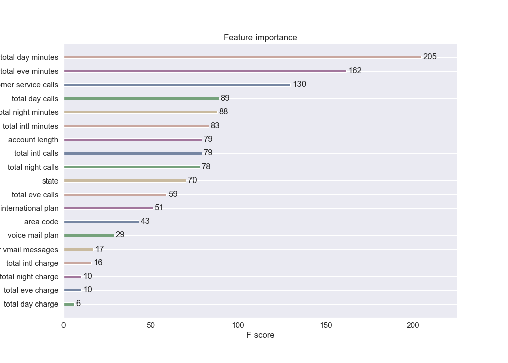

# mod3_project
---

## About
For this project I gathered my data from https://www.kaggle.com/becksddf/churn-in-telecoms-dataset  
This dataset has 3333 instances of 20 descriptive features and 1 target variable. 
<u>Descriptive features</u>: 
   >state                   
    account length            
    area code                 
    phone number              
    international plan        
    voice mail plan           
    number vmail messages     
    total day minutes         
    total day calls           
    total day charge         
    total eve minutes         
    total eve calls           
    total eve charge          
    total night minutes       
    total night calls        
    total night charge       
    total intl minutes        
    total intl calls          
    total intl charge         
    customer service calls 

<u>Target variable</u>
>churn

## Goal

The goal for this project is to determine what leads customers astray and to predict if a customer will leave.

## A look inside
In this dataset we have a churn rate close of approx 15%

Five states with highest churn rate

Churn rate is higher for customers with a international plan. Roughly 10% of customers use this feature.

## Hypothesis testing

The distribution of Total charges is different for the churned customers as viewed here.
It seems that customers who pay more than 80 are more liklely to leave.

The proportion of customers who leave us is greater than those who don't for the subset of customers who call customer service more than 4 times

## Modeling 

Since the dataset has a significant amount of class imbalance I used SMOTE to create synthetic samples of the smaller class (customers who left)

Fitted models include:
>Logistic Regression 
KNN 
Decision Tree 
SVC 

with decision tree and svc coming in first

I applied a gridsearch using decision tree and got a slightly better score. Ensemble method Random forest came in higher, so I did a grid search over that which improved my score. 
Finally I applied a Xgboost classifier which gets the top score.
Here are the contributing features.

This is a summary of the models and their scores 

## Summary

The final model can predict 82% of all customers who leave. 
The length of calls is the greatest influence on our predictions. This leads me wondering whether there is some level of service interruption. Moving forward we should collect data on dropped calls and overall call quality. Additionally, we need to be more careful with our customer service, it would be wise to add a feature including the reason for their call.

